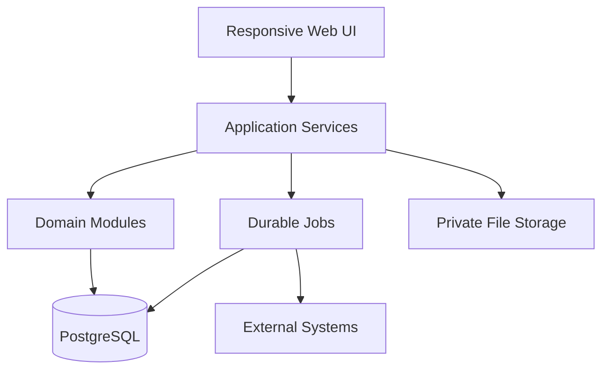

# 2. Technical Architecture

## 2.1 Recommended baseline

Use a responsive web application implemented as a modular monolith:

- TypeScript in strict mode;
- Next.js with server-rendered application routes and explicit application services;
- PostgreSQL as the transactional system of record;
- a typed ORM/query layer with migrations and database constraints;
- a durable background-job queue for imports, summaries, forecasts and alerts;
- private object storage for invoices, import files, photographs and exports;
- an internal authentication module inside the modular monolith (users, credentials, roles, scopes, sessions, TOTP 2FA). Managed OIDC was considered and rejected by DEC-013 — there is no external identity provider;
- containerized local, staging and production environments.

Exact framework and library versions must be selected and pinned when implementation starts. Business logic must not be coupled to framework route handlers or UI components. The modular monolith's component runtimes and deployment topology are defined in `docs/adr/0012-deployment-topology-and-service-runtimes.md`.

## 2.2 Logical topology

## 2.3 Domain modules

| Module | Owns | May consume |
| --- | --- | --- |
| Identity & Organization | users, roles, scopes, locations, channels | audit |
| Catalog | items, units, packaging, allergens, products | supplier data |
| Recipes | recipe versions, lines, yield, portions | catalog, labor assumptions |
| Procurement | suppliers, supplier items, orders, receipts | catalog, inventory |
| Costing | cost cards, cost pools, allocation rules, snapshots | recipes, procurement, labor |
| Pricing | price scenarios, approvals, effective prices | costing, channels, tax rules |
| Inventory | movements, lots, balances, counts, transfers | procurement, production, sales |
| Production | plans, batches, consumption, output | recipes, inventory, forecast |
| Sales | transactions, lines, mapping, refunds, discounts | products, channels |
| Reconciliation | source totals, settlements, close | sales, costing snapshots (read-only), inventory |
| Insights | aggregates, metrics, forecasts, recommendations | read models from all modules |
| Workflow | alerts, tasks, approvals, comments | domain events |
| Integration | import runs, source mappings, sync cursors | all boundary modules |
| Audit | immutable activity and change records | all mutations |

Modules communicate through application commands, queries and recorded domain events. Direct cross-module table updates are prohibited.

## 2.4 Layering

- **Presentation:** pages, forms, tables, charts, API route adapters.
- **Application:** use cases, transactions, authorization, idempotency and orchestration.
- **Domain:** entities, value objects, calculations, policies, invariants and state transitions.
- **Infrastructure:** database repositories, object storage, queues, email/notifications and external adapters.

No financial calculation should exist only in UI code or SQL used by a dashboard. Canonical calculations live in tested domain/application services; reporting views may materialize their outputs.

## 2.5 Data architecture

- Use UUID/ULID identifiers; never use human labels as foreign keys.
- All mutable business tables include organization ID, created/updated timestamps and actor metadata.
- Location-scoped records include explicit `location_id`; company-wide records use documented nullable scope.
- Monetary amounts use decimal/numeric types and ISO currency codes; never binary floats.
- Quantities use decimal types plus explicit unit IDs.
- Effective-dated values have non-overlapping validity windows enforced in application logic and, where practical, exclusion constraints.
- Approved calculations are snapshotted with input references, versions, rule versions and result components.
- Stock balance is a projection of an append-only movement ledger, not an independently editable number.
- Reporting aggregates are disposable and rebuildable from canonical records.

## 2.6 Transaction boundaries

The following operations must be atomic:

- accepting a receipt and creating stock movements;
- posting a production batch and recording input/output movements;
- posting a transfer with paired source/destination movements;
- approving a count and posting variance adjustments;
- posting valid sales lines and any theoretical-consumption movements;
- approving a cost card or price version with its snapshot;
- closing a period and recording its reconciliation snapshot.

External calls must not be kept inside long database transactions. Use an outbox table and idempotent job consumers for asynchronous work.

## 2.7 Environments and deployment

- Local: containerized app, database, job worker and local-compatible object storage.
- Staging: production-like services with sanitized or synthetic data.
- Production: isolated database/storage, encrypted backups, managed secrets and monitored workers.
- CI: lint, type check, unit tests, integration tests, migration checks and dependency/security scanning.
- CD: pre-deploy migration job applies pending, backward-compatible migrations, then application components roll to the new revision; verify health, then release workers.
- Hosting (decided 2026-09-18): application runtimes (`web`, `api`, `worker`, `scheduler`) deploy as
  **DigitalOcean App Platform components**; the database is **DO Managed PostgreSQL with PITR**
  (DEC-014) and files live in **DO Spaces** — provisioned with **Terraform**, with a **pre-deploy
  migration job** (`npm run db:migrate`). See `docs/adr/0012-deployment-topology-and-service-runtimes.md`
  and `docs/runbooks/deployment.md`.

Do not combine destructive schema changes with application changes that still need old fields. Use expand/migrate/contract releases.

## 2.8 Observability

Structured logs include correlation ID, actor, location, module, operation and job/import ID without exposing sensitive payloads. Metrics include request errors/latency, queue depth, job age, import freshness, reconciliation status, backup state and data-quality exceptions. Critical failures create actionable alerts with retry/recovery guidance.

## 2.9 Architecture decision records

Maintain `/docs/adr/NNNN-title.md`. Required early ADRs:

1. application framework and deployment platform;
2. ORM/query layer and migration strategy;
3. internal authentication (users, credentials, sessions, TOTP 2FA) and role model — no external identity provider (DEC-013);
4. background job technology and outbox implementation;
5. stock valuation and theoretical sale-consumption policy;
6. file storage and retention;
7. reporting aggregate strategy;
8. integration ownership and system-of-record boundaries.

