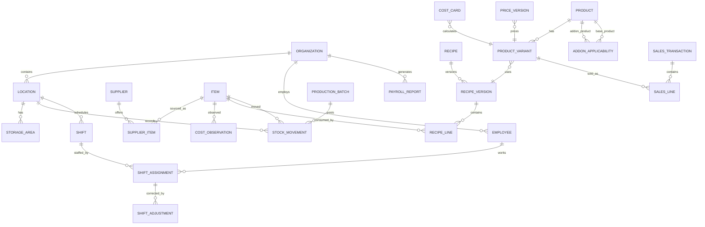

# 3. Domain Model

## 3.1 Relationship overview

## 3.2 Shared concepts

### Organization and scope

- `Organization`: legal/operating entity, currency, timezone and global settings.
- `Location`: Kongens gate, Tullinløkka, future locations or central production.
- `StorageArea`: kitchen, dry store, refrigerator, freezer, front counter or transit.
- `Channel`: dine-in, takeaway, Wolt, direct online or another sales source.
- `CostCenter`: company shared, location, kitchen, front of house or project/event.
- `User`, `Role`, `UserRole`, `LocationScope`: identity and authorization. Roles are granted with a
  location scope; authorization is enforced server-side (`07.1`, FND-002). Named employee data is not
  required for costing (DEC-012).
- Ownership and accountability: the product owner, technical owner and operational-data owner, plus the
  per-data-area business owners (products/recipes/allergens; supplier items and costs; prices/channels/
  tax; inventory and waste; sales mappings and settlements; labour assumptions; competitor observations;
  user access and audit), are modelled as **assignable role/permission grants** with effective dates and
  audit, not as fixed fields on an entity. Paulo Paes is the initial holder, not a hard-coded constant
  (DEC-014, FND-007).

### Units

- `Unit`: canonical mass, volume, count, time or package unit.
- `UnitConversion`: factor between units, scoped globally or to an item when density/piece weight is item-specific.
- Conversion graph must reject ambiguity, cycles that produce inconsistent factors, zero/negative factors and incompatible dimensions.

## 3.3 Catalog and procurement

- `Item`: ingredient, packaging, cleaning supply, consumable, finished good, intermediate or non-stock supply. Fields include a business-controller-owned **`sku`** (stable item code, unique per organization, published to the POS and used as the primary reconciliation key), base unit, inventory policy (`stocked` / `non_stock` / `made_to_order`), lot tracking, shelf-life defaults, allergen metadata, active dates and a manually maintained **`current_cost`** (`current_cost_updated_at`) used as the last-resort cost (DEC-047).
- `Supplier`: identity, contact and commercial terms. **Optional** on procurement records: most items are bought ad hoc from grocery stores with no supplier master, so a purchase may instead carry a free-text `store_name` where the store is unspecified (DEC-047).
- `SupplierItem`: supplier SKU, linked item, pack quantity/unit, minimum order, lead time and preferred flag. Only for real supplier relationships; ad-hoc purchases do not require one.
- `PurchaseOrder` and `PurchaseOrderLine`: optional planning record; approval/status lifecycle.
- `GoodsReceipt` and `GoodsReceiptLine`: received quantity, accepted/rejected quantity, lot/expiry, landed charges and evidence. `supplier_id` is nullable and `store_name` may be used instead (DEC-047).
- `SupplierPrice`: effective-dated price, currency, tax basis, discount, freight/allocation and source receipt/invoice. Only for items bought from a real, known supplier.
- `CostObservation`: a recorded cost for an item from a receipt, a manually entered price or the owner's price Excel files. Fields: item, store name (or optional supplier), observed date, pack size and unit, pack price, currency, source (`receipt` / `manual` / `excel`), receipt/file reference and notes. This is the general cost-catalogue record for ad-hoc grocery purchases where no supplier price exists (DEC-047).

An item may have many supplier packs. A pack is converted to the item base unit before cost comparison or stock posting.

**Selected base-unit cost (DEC-047).** The cost used for costing resolves in strict precedence: (1) the
latest **approved supplier price** effective on or before `as_of`; failing that, (2) the **latest recorded
cost observation** (`CostObservation`) on or before `as_of`; failing that, (3) the item's manually
maintained **`current_cost`** as the fallback. The resolved cost is snapshotted with its source
(`source_type`) and observed date, so a calculation shows which of the three supplied the number.

## 3.4 Recipes and products

- `Recipe`: stable identity and ownership.
- `RecipeVersion`: immutable after approval; draft/approved/retired state; effective dates; planned input, planned output, yield basis, preparation time and notes.
- `RecipeLine`: ingredient, packaging or sub-recipe reference; quantity; unit; loss/waste factor; stage and optional substitution group.
- `SubRecipe`: represented by a recipe producing a stocked or non-stocked intermediate item.
- `Product`: commercial grouping such as cheese bun, cake or açaí bowl, carrying a taxonomy classification `product_kind` (`base` / `variant` / `add_on`) and a platform-owned **`sku`** (DEC-044).
- `ProductVariant`: size/channel/location-relevant sellable identity and external mappings. Carries a business-controller-owned **`sku`** (stable sellable code, unique per organization, published to the POS and used as the primary reconciliation key) and the same `product_kind` taxonomy (DEC-044).
- `ProductRecipeAssignment`: effective-dated link from product variant and location to an approved recipe version.
- `AddonApplicability`: effective-dated relation linking an add-on product to the base products (and/or categories) it may be added to, with an optional price effect (DEC-044).
- `Allergen` and `RecipeAllergen`: derived plus explicitly verified declarations.

**Item vs Product (DEC-030).** `Item` is the inventory identity; `Product`/`ProductVariant` is the
sellable identity. A `ProductVariant` references zero or one stocked `Item` (the finished good it
consumes/produces) and one effective-dated `ProductRecipeAssignment`. A sub-recipe is a `Recipe` that
produces an intermediate `Item`, never a `Product`. There is no parallel sellable/stocked catalog.

**Product taxonomy and SKU ownership (DEC-044).** Every sellable item — base product, variant and add-on — is a
distinct product with its own platform-owned `sku`. The taxonomy (`base` / `variant` / `add_on`) and the SKU
catalogue are owned by the business controller and published to the POS; sales lines reference SKUs rather than
free-text names. Add-on classification drives menu engineering and costing; it does **not** reconstruct
parentage automatically — a line is linked to its parent only when the POS supplies the parent/child
relationship.

Recipe lines cannot reference drafts when approving a parent recipe. Cyclic sub-recipes are prohibited.

## 3.5 Costs and pricing

- `OperatingCost`: amount, recurrence, fixed/variable/mixed classification, cost center, location, vendor, effective dates and evidence.
- `LaborRate`: role/cost-center loaded hourly rate, productive-time assumption and effective dates. Named employee data is not required by default.
- `Asset`: purchase/lease value, useful life, location, cost center, depreciation/lease policy and active dates.
- `CostPool`: approved collection of overhead costs.
- `AllocationRule`: driver, scope, period, denominator source, fallback behavior and effective dates.
- `CostCard`: product, recipe, location/channel context, calculation timestamp, approval state and snapshot reference.
- `CalculationSnapshot`: all component quantities/costs, versions, rules, rounding and result totals required to reproduce the result.
- `PriceScenario`: proposed gross/net price, tax configuration, volume assumption, channel fees, contribution/full-cost outcomes and comparison baseline.
- `PriceVersion`: approved price by product variant, channel, location and effective interval.
- `TaxRule`: effective-dated rate by product/service type × channel × location scope, carrying `tax_basis` (inclusive/exclusive), input-tax `recoverable` and `tax_treatment` (`fixed` / `channel_overridable`) (DEC-003, DEC-022, DEC-045).
- `ChannelFeeRule`: commission / processing / fixed per-order fee with an explicit `fee_basis` (gross price, net price or per order) and tax rule (PRICE-001).
- `ExchangeRate`: base/quote currency, rate, rate date and source; a resolved rate is required before any mixed-currency calculation (DEC-023).

## 3.6 Inventory and production

- `StockMovement`: append-only signed quantity delta (`quantity_delta`, positive in / negative out) with location/storage area, movement type, event time, posting time, unit cost, value, lot, `(source_type, source_id)` provenance, reason code and reversal link. Storage area and lot are optional only where the movement type allows.
- `StockLot`: received/produced lot, expiry, original quantity and traceability metadata.
- `StockBalance`: projection keyed by item/location/storage/lot; never edited directly.
- `StockCount`: draft/submitted/approved count session with blind-count option.
- `CountLine`: expected, counted, variance, reason and approval.
- `Transfer`: requested/dispatched/received/cancelled; source and destination posting references. In-transit stock is held as a balance bucket on a virtual transit location/storage area: dispatch moves source → transit, receipt moves transit → destination (DEC-029).
- `ProductionPlan`: quantities by recipe/product, location and production date.
- `ProductionBatch`: recipe version, planned/actual input/output, yield, timestamps, operator and status.
- `ProductionBatchInput` / `ProductionBatchOutput`: per-line planned vs actual quantity, unit, variance, lot and reason, so planned-vs-actual yield variance is stored per component (PROD-003, DEC-031).
- `WasteEvent`: item/batch/product, quantity, stage, reason, value method, location, actor and optional action.
- `ReorderPolicy`: lead time, safety stock, review cadence, order multiple, minimum and preferred supplier.

Every posted movement has one business source. Corrections use reversal/adjustment entries; posted movements are not overwritten. A reversal restores the original movement's quantity and value; where this leaves a moving-average gap, an explicit `revaluation` correction movement is posted with a reason so the ledger stays balanced at every cutoff (DEC-028).

## 3.7 Sales and reconciliation

- `ImportRun`: source, file hash, period, status, row counts and diagnostics.
- `ExternalMapping`: source system/type/external ID to internal entity with effective dates.
- `SalesTransaction`: source ID, location, channel, timestamps, gross/net/tax/discount/refund totals and currency.
- `SalesLine`: product variant (nullable until mapped), `sku` (the published stable key, preferred over the external product reference for mapping), quantity, gross/net/tax/discount/refund, `channel_id`, `applied_tax_rate` (the rate actually applied on the line, alongside `tax_code`), `parent_line_id` (self-reference when the line is an attached option), `option_kind` (`standalone` / `attached` / `included`), channel fee basis and `mapping_state` (`unmapped` / `mapped` / `ignored` / `error`). Add-ons may arrive as separate standalone lines or as options attached to a parent product; import normalizes both into lines carrying `option_kind` and `parent_line_id`. Unmapped or invalid rows are retained in a review queue and never discarded (SALE-004).
- `Settlement`: channel/payment provider period and paid/fee/refund totals.
- `Reconciliation`: expected/actual values, tolerance, differences, status and resolution.
- `PeriodClose`: scope/period, prerequisite checklist, snapshots, approver, lock state and correction policy.
- `AdjustmentPeriod`: an open period in which corrections to locked periods post as linked reversals/adjustments, instead of silently reopening history (DEC-027).

Source identity plus external transaction/line identity must be unique so replay cannot duplicate sales.

**Channel and VAT are per line.** The new Frontline POS charges **25 % dine-in** and **15 % takeaway/catering**
on the **same product** — there are no separate " T" products. The applied rate therefore varies by channel
on an identical item, so each `SalesLine` must capture both `channel_id` and the `applied_tax_rate` actually
applied, not only a `tax_code` resolved from the product (DEC-041, DEC-042).

**Every sales line is a SKU (DEC-044).** A line is a base product, variant or add-on SKU, classified by
`product_kind` in the platform taxonomy. The classification is used for menu engineering and costing; it is not
used to reconstruct parentage. A line is linked to a parent only when the POS actually provides the
parent/child relationship (`parent_line_id` / `option_kind`).

**VAT resolution is fixed-or-channel (DEC-045).** Each line resolves tax in a defined order: a **fixed** item
rate where one is defined (for example a book at 0 %, or retail packs such as flour mixes and coffee bean bags
at 15 %), otherwise the item default rate with a **channel override** (eat-in 25 % / takeaway 15 %). The resolved
`applied_tax_rate` is stored on the sales line for reconciliation.

## 3.8 Planning and workflow

- `Forecast`: method, grain, scope, horizon, generated time, inputs, prediction intervals and actual-error results.
- `BudgetScenario`: assumptions and period values; never overwrites actuals.
- `CompetitorSource`: an approved competitor data source. Fields: competitor (`competitor_name` and optional `competitor_id`), source type (`website` / `wolt` / `instagram_manual` / `other`), URL or identifier, collection mode (`automated` / `manual`), terms/approval status, active dates and rate-limit/config notes. A competitor may have several sources.
- `CompetitorObservation`: references a `CompetitorSource` and carries observed date, source URL, offer, product category, price, notes, season, reviewer and provenance.
- `Experiment`: hypothesis, products/locations/channels, start/end, measures and conclusion.
- `Task`: type, linked record, owner, due date, priority, status and resolution.
- `Approval`: entity/version, requested/decided actor, timestamps, decision and comment.
- `AuditEvent`: actor, action, entity, before/after references, request/correlation ID and timestamp.
- `OutboxEvent`: transactional event record written with the business change, deduplicated by ID and consumed idempotently (`02.6`, `06.4`).
- `Job`: durable background job (import, summary, forecast, alert) with attempts, status, dead-letter state and idempotency key (OPS-001/002).
- `FileObject`: private stored file with checksum, MIME, size, retention policy and linked entity; deletion never removes the financial/operational fact (`03.10`, SEC-002).
- `DataQualityException`: rule code, severity, entity reference, owner, due date and resolution (DQ-001).

Automated competitor collection runs only for approved, permitted sources; restricted sources (for example Instagram) are captured manually in-app and never scraped; observations require human review before use (DEC-020).

## 3.9 Workforce

Workforce scheduling is in the MVP (DEC-037). Employee names are personal data and are permission-gated;
costing never reads them (DEC-012).

- `Employee`: organization-scoped person who can be scheduled. Fields: name, role, employment type,
  base hourly rate, cost centre, primary location, active dates and an optional link to an `app_user`
  (an employee may exist without a login). Distinct from `app_user`, which is an authenticated identity.
- `Shift`: a schedulable time window at a location. Fields: location, role, start/end, break minutes,
  state (`open` / `published` / `assigned` / `cancelled`), published timestamp and creator.
- `ShiftAssignment`: links a `Shift` to an `Employee`. Fields: shift, employee, state
  (`self_assigned` / `approved`), assigned by/at.
- `ShiftAdjustment`: manager manual correction of hours on an assignment (DEC-038). Fields: assignment,
  adjusted hours, reason, approved by/at.
- `PayrollReport`: the monthly payroll-input report for the accountant. Fields: organization, period,
  generated at/by, status, snapshot and export file reference.

Boundaries:

- Costing reads only productive hours and a loaded hourly rate, with no link from costing to an
  individual employee (DEC-012). `LaborRate` stays role/cost-centre scoped.
- Worked hours derive from scheduled/registered shifts, with manager corrections recorded as
  `ShiftAdjustment` entries (DEC-038). There is no clock-in/clock-out in the MVP, but the schema keeps
  room for actual time tracking later.
- `PayrollReport` is a payroll-**input** report (employee, hours, hourly rate, expected pay) generated
  about three days before month-end from registered shifts plus the assumption that remaining planned
  shifts run as scheduled. Statutory payroll processing, tax withholding and payslips are out of scope.

## 3.10 Deletion rules

Master records referenced by transactions are retired, not deleted. Draft records without downstream references may be deleted subject to audit. Attachments follow retention policy; deleting a file must not remove the financial/operational fact or its provenance metadata.

